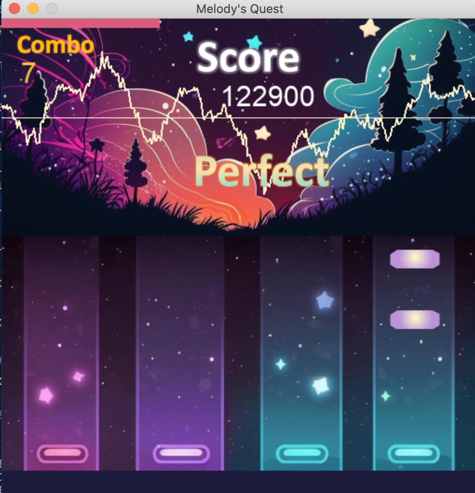
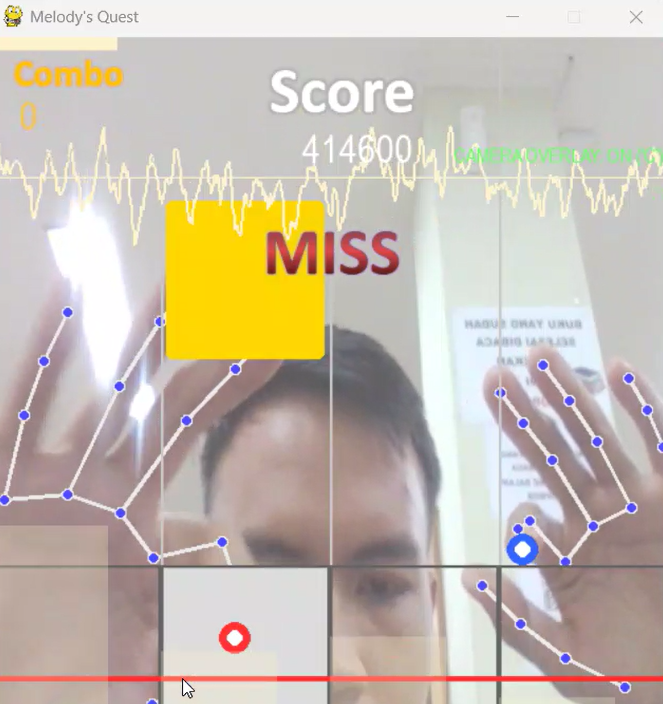

# Melody's Quest
Melody's Quest is an intelligent rhythm game developed based on the PyGame framework. It enables users to import their preferred songs and automatically generates a beatmap for gameplay. The game integrates various Artificial Intelligence concepts such as Agentic AI, Search Algorithms, Fuzzy Logic, and Computer Vision to provide an adaptive and interactive experience.

## Features
- **Intelligent Auto-Play Bot (Uninformed Search - BFS):** An automated bot that uses Breadth-First Search to find the shortest path for lane transitions to hit all active notes perfectly.
- **Dynamic Bonus Notes (Informed Search - A*):** Dynamically spawns bonus notes using the A* algorithm, considering the player's current hand position and the song's predicted arousal/valence.
- **Adaptive Difficulty (Fuzzy Logic):** Adjusts the falling speed of notes in real-time based on the player's current combo and the music's energy (arousal).
- **Hand Tracking Gameplay (Computer Vision):** Play the game using your hands! Utilizes OpenCV and Mediapipe to track index fingers, allowing a camera-based, dual-hand interaction without touching the keyboard.
- **Machine Learning Mood Detection:** Predicts the arousal and valence of the imported song using Linear Regression and Random Forest models, changing the game's color palette and visualizers to match the mood.
- **Automatic Beatmap Generation:** Utilizes music information retrieval techniques (librosa, onset detection, pitch estimation, melody extraction) to generate accurate beatmaps.

:** An automated bot that uses Breadth-First Search to find the shortest path for lane transitions to hit all active notes perfectly.
- **Dynamic Bonus Notes (Informed Search - A*):** Dynamically spawns bonus notes using the A* algorithm, considering the player's current hand position and the song's predicted arousal/valence.
- **Adaptive Difficulty (Fuzzy Logic):** Adjusts the falling speed of notes in real-time based on the player's current combo and the music's energy (arousal).
- **Hand Tracking Gameplay (Computer Vision):** Play the game using your hands! Utilizes OpenCV and Mediapipe to track index fingers, allowing a camera-based, dual-hand interaction without touching the keyboard.
- **Machine Learning Mood Detection:** Predicts the arousal and valence of the imported song using Linear Regression and Random Forest models, changing the game's color palette and visualizers to match the mood.
- **Automatic Beatmap Generation:** Utilizes music information retrieval techniques (librosa, onset detection, pitch estimation, melody extraction) to generate accurate beatmaps.


.


## How to run
### Prerequisites
- Python 3.10+
- A webcam (if you want to use the Computer Vision gameplay feature)

1. Install the dependencies
```bash
pip install -r requirements.txt
```

2. Run the game
```bash
python main.py
```

3. Select your music file (`.wav` or `.mp3`) when the file dialog appears.
4. **Controls In-Game:**
   - **Keyboard Mode:** `A`, `S`, `K`, `L` for the 4 lanes.
   - **Camera Mode:** Press `C` to toggle the camera overlay and use your index fingers to play!
   - **Auto-Play Bot:** Press `B` to activate the BFS bot and watch it play automatically.

## Details
1. **main.py:** The main program of the rhythm game integrating PyGame, ML models, AI Agents, and OpenCV.
2. **LR_arousal.sav:** Pre-trained model to predict arousal level.
3. **RF_valence.sav:** Pre-trained model to predict valence level.
4. **requirements.txt:** List of all required Python packages (including OpenCV, Mediapipe, Librosa, PyGame, etc.).
)

## How to run
### Prerequisites
- Python 3.10+
- A webcam (if you want to use the Computer Vision gameplay feature)

1. Install the dependencies
```bash
pip install -r requirements.txt
```

2. Run the game
```bash
python main.py
```

3. Select your music file (`.wav` or `.mp3`) when the file dialog appears.
4. **Controls In-Game:**
   - **Keyboard Mode:** `A`, `S`, `K`, `L` for the 4 lanes.
   - **Camera Mode:** Press `C` to toggle the camera overlay and use your index fingers to play!
   - **Auto-Play Bot:** Press `B` to activate the BFS bot and watch it play automatically.

## Details
1. **main.py:** The main program of the rhythm game integrating PyGame, ML models, AI Agents, and OpenCV.
2. **LR_arousal.sav:** Pre-trained model to predict arousal level.
3. **RF_valence.sav:** Pre-trained model to predict valence level.
4. **requirements.txt:** List of all required Python packages (including OpenCV, Mediapipe, Librosa, PyGame, etc.).
